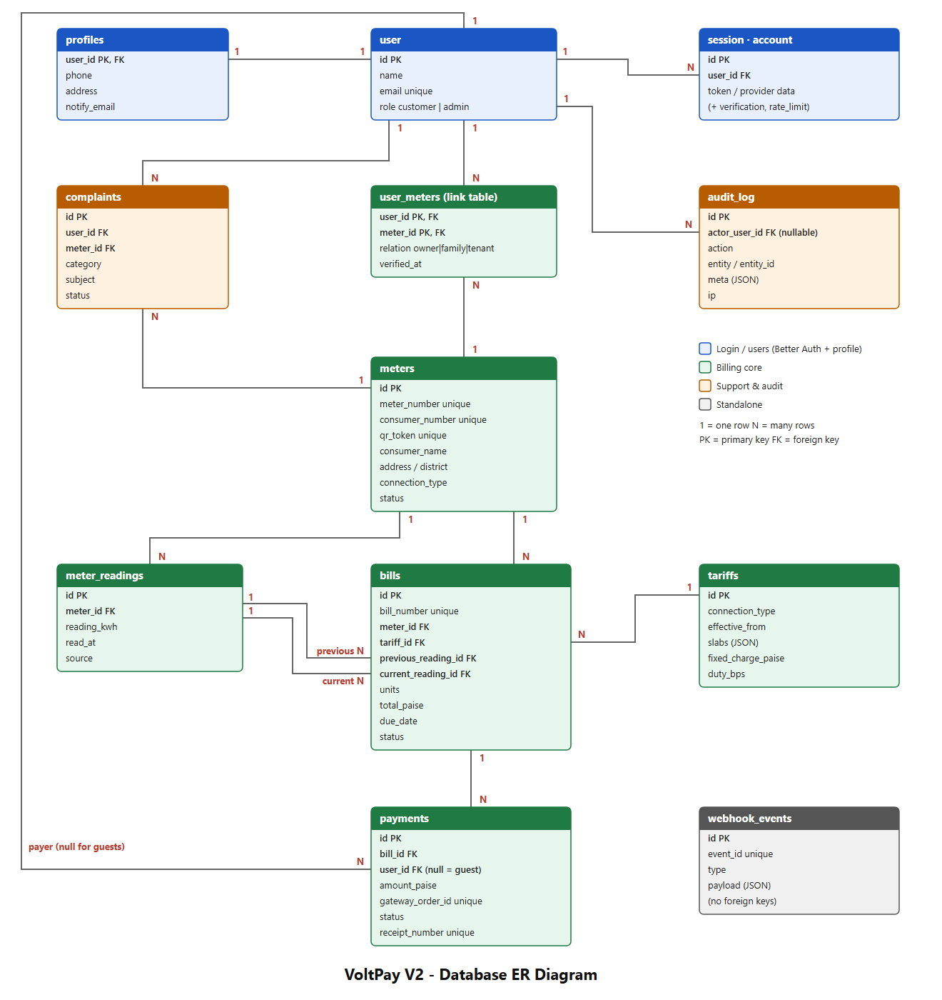
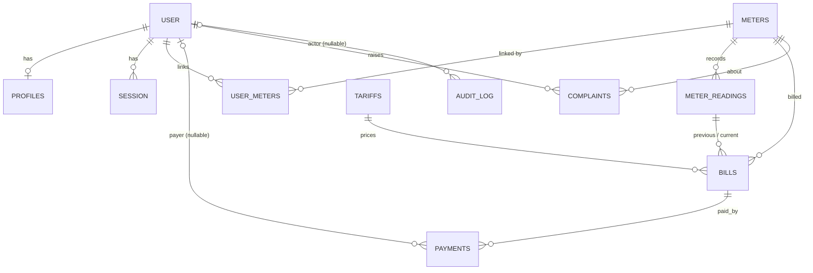

# VoltPay V2 — ER Diagram (study notes)

Latest full diagram (all 17 tables, incl. reminder_log, contact_messages, throttle): `er-diagram-current.png` / `er-diagram-current.svg`.

Files: `er-diagram.png` (picture) · `er-diagram.svg` (same picture, sharp at any zoom — open in a browser).
Source of truth: `src/db/schema/` (`auth.ts`, `billing.ts`, `account.ts`, `audit.ts`).

An **ER (Entity-Relationship) diagram** shows the tables in a database (entities) and how they connect (relationships).
`1` = one row, `N` = many rows. **PK** = primary key (unique ID of a row). **FK** = foreign key (a column pointing to another table's PK).

---

## The main chain (remember this one line)

**User → (user_meters) → Meter → Readings → Bills → Payments → Receipt**

| Step | Meaning |
|---|---|
| User | A person who logs in (customer or admin) |
| user_meters | Which users are connected to which meters |
| Meter | The physical electricity connection (has the QR sticker) |
| Readings | The meter's running kWh number, recorded over time |
| Bills | Calculated from two readings (previous & current) + a tariff |
| Payments | Attempts to pay a bill; a bill can be successfully paid only once |

## Tables in groups

**Login / users** — `user`, `session`, `account`, `verification`, `rate_limit` are created and managed by the Better Auth library. `profiles` (1:1 with user) holds phone, address and email preferences.

**Billing core**
- `meters` — unique `meter_number`, `consumer_number` and a random `qr_token`.
- `user_meters` — the **link (join) table**. Makes users ↔ meters **many-to-many**. Primary key is the pair (`user_id`, `meter_id`), so the same link can't be stored twice.
- `tariffs` — price slabs stored as JSON, plus fixed charge and duty.
- `meter_readings` — one reading per meter per date; can't be negative.
- `bills` — points to a meter, a tariff and **two** readings (previous, current). `units = current − previous`.
- `payments` — belongs to a bill. `user_id` can be empty (guest payment, like BBPS).

**Support & audit**
- `complaints` — a user's complaint about a meter.
- `audit_log` — who did what, when (admin actions, payment state changes).

**Standalone**
- `webhook_events` — every Razorpay webhook we processed. Unique `event_id` makes handling **idempotent** (same event twice = processed once).

## Relationships

| From | To | Type | Note |
|---|---|---|---|
| user | profiles | 1 : 1 | |
| user | session / account | 1 : N | |
| user | meters | N : M | through `user_meters` |
| meters | meter_readings | 1 : N | |
| meters | bills | 1 : N | |
| tariffs | bills | 1 : N | |
| meter_readings | bills | 1 : N (twice) | as `previous_reading` and `current_reading` |
| bills | payments | 1 : N | only one `captured` payment per bill |
| user | payments | 1 : N | nullable → guest payments |
| user | complaints | 1 : N | |
| meters | complaints | 1 : N | |
| user | audit_log | 1 : N | nullable `actor_user_id` |

## What happens when a parent row is deleted (`onDelete`)

| Rule | Behaviour | Example here |
|---|---|---|
| `cascade` | Children are deleted too | Delete a user → their `user_meters` links, profile and complaints go |
| `restrict` | Deletion is blocked | A meter that has bills can't be deleted |
| `set null` | Child stays, the reference is cleared | Delete a user → their payments stay, `user_id` becomes empty |

## Rules the database itself enforces (constraints)

- `meter_number`, `consumer_number`, `qr_token`, `bill_number`, `receipt_number`, `gateway_order_id` are **unique**.
- Reading, units and total can **never be negative** (CHECK constraints).
- Only **one captured payment per bill** (partial unique index `payments_one_captured_per_bill`).
- One bill per meter per period, one reading per meter per date.
- All money is an **integer in paise** (₹1 = 100 paise), never a float.

## Interview-ready answers

- **"Explain your database design."** *"The core chain is User → Meter → Readings → Bills → Payments. A join table handles the many-to-many between users and meters. Bills reference two readings and a tariff so every amount is auditable. Constraints enforce rules like one captured payment per bill."*
- **"Why a separate `user_meters` table?"** *"One user can own several meters and one meter can be shared by a family, so the relationship is many-to-many. A join table is the standard way to model that, and it also stores the relation type and verification time."*
- **"Why store money as integers?"** *"Floating-point numbers can't represent decimals exactly, so totals drift. Integer paise are exact."*
- **"How do you stop double payment?"** *"A partial unique index allows only one captured payment per bill, webhook events are de-duplicated by event ID, and state changes happen in one database transaction."*

## Mermaid version (renders on GitHub)

